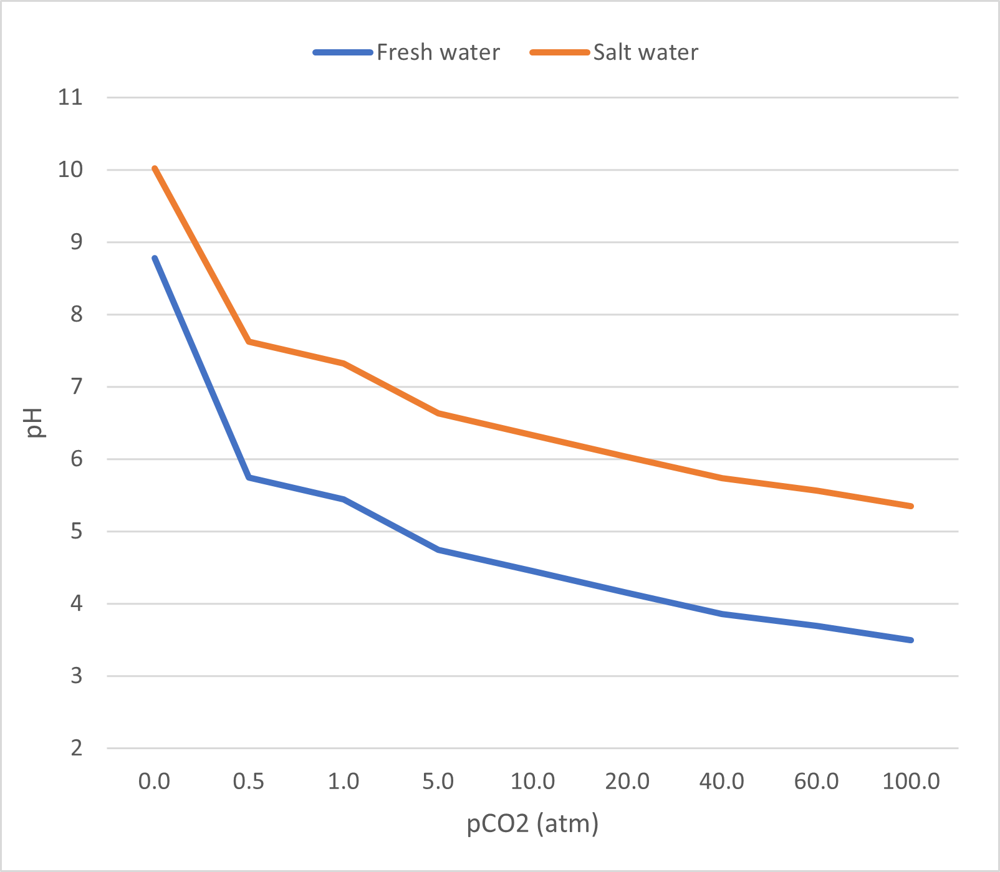

# Geochemistry Data Processing Script

## Overview

This Python script processes `.txt` files containing geochemical field or lab data by converting their contents into `.csv` format and extracting pH values. It is especially useful for organizing datasets that distinguish between freshwater and saltwater environments — two key domains in understanding the biogeochemical impacts of increasing atmospheric CO₂ levels.

## Why This Matters: CO₂, Water Chemistry, and pH

As atmospheric CO₂ concentrations rise due to anthropogenic emissions, more CO₂ dissolves into aquatic systems. This results in a well-documented process called **ocean acidification** (and freshwater acidification), where CO₂ reacts with water to form carbonic acid, which lowers pH.

Monitoring **pH levels** in different water bodies — especially across freshwater and saltwater gradients — is a critical indicator of these changes. Slight pH shifts can have major impacts on:

- Marine and freshwater ecosystems
- Nutrient cycling
- Carbon sequestration capacity
- Shell-building organisms and microbial processes

This script helps environmental scientists, students, and researchers efficiently manage and analyze pH data across multiple files and formats, contributing to larger efforts to quantify and understand the effects of CO₂ on natural waters.

## Features

- Reads all `.txt` files from a specified input folder.
- Outputs cleaned and structured `.csv` files to a designated folder.
- Extracts pH values when lines beginning with `pH` are present.
- Generates two summary CSVs:
  - `fresh_pH_summary.csv`
  - `salt_pH_summary.csv`

## Folder Structure

GeochemFinal/ # Input .txt files for general conversion

GeoFinal/ # Output folder for converted .csv files

GeoFreshSalt15/ # Input .txt files with fresh/salt pH data

GeoexcelFreshSalt15/ # Output .csv files and summary files


## How to Use

1. **Edit the folder paths** in the script to match your system:

    ```python
    folder_path = r""
    output_csv_folder = r""
    ```

2. **Run the script** using a Python interpreter

3. **Check the output folders** for:
    - Individual `.csv` files matching each input file.
    - `fresh_pH_summary.csv` and `salt_pH_summary.csv` summarizing the extracted pH values.
  
4. **example of final visualization**



## Requirements

- Python 3.x
- No external libraries needed (uses `os` and `csv` from the Python standard library)

## Notes

- The script assumes that pH values appear on lines starting with the keyword `pH` and that the pH value is the third element on the line.
- File name prefixes (`fresh` or `salt`) are case-insensitive and used to categorize summary entries.

